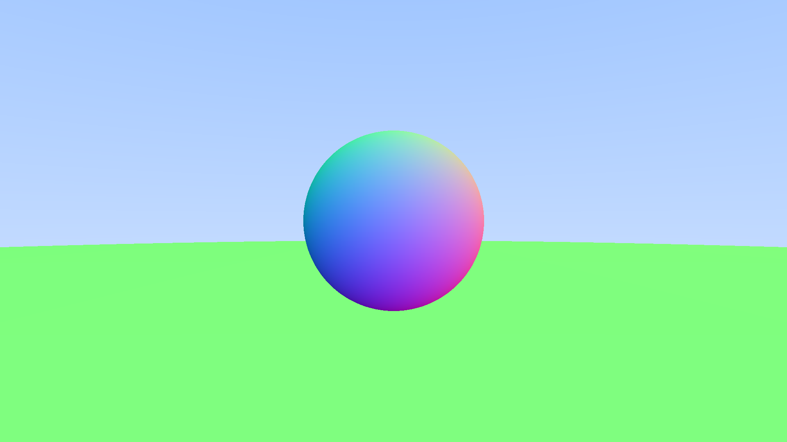
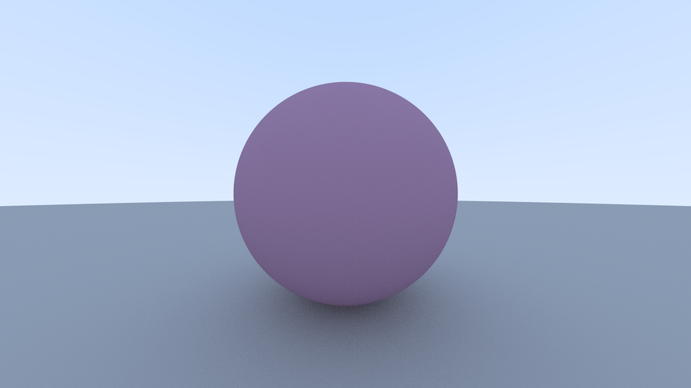
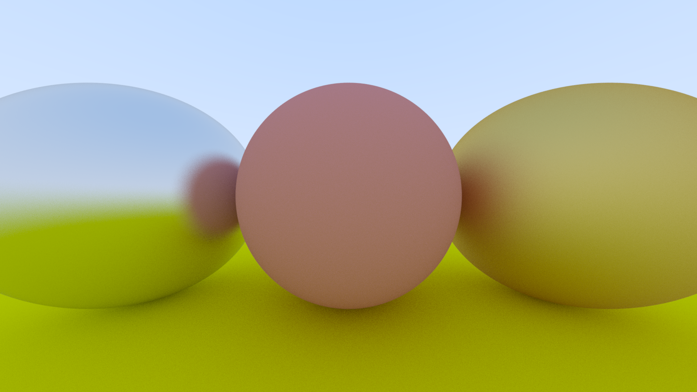
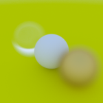
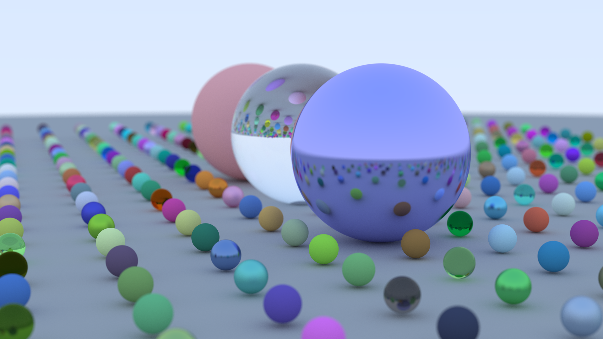
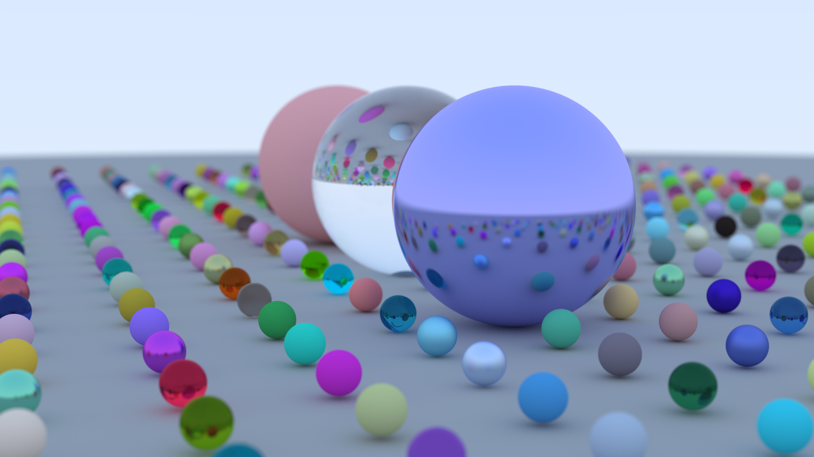
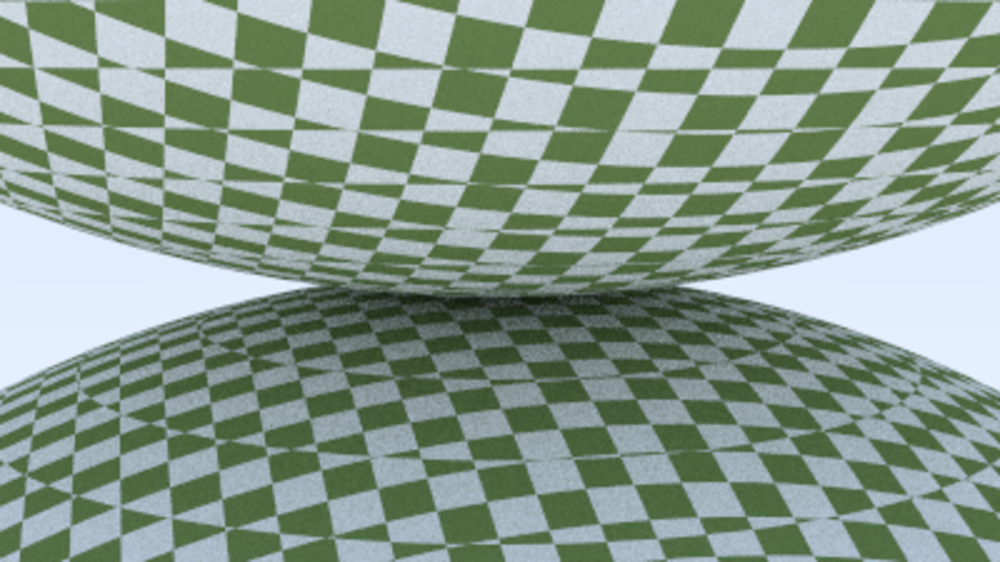
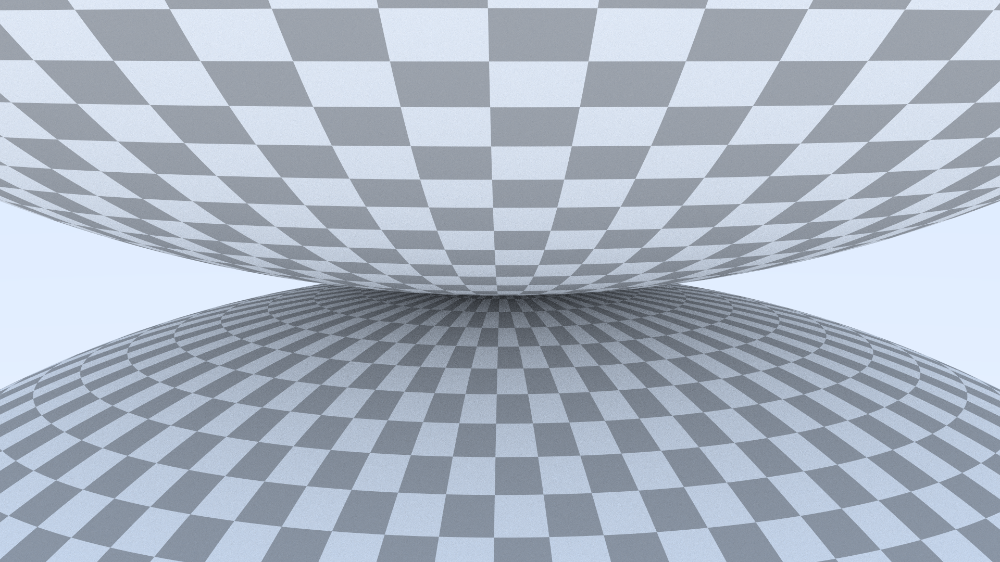

# Nick's Ray Tracer

A ray tracer written in Rust following the [Ray Tracing in One Weekend](https://raytracing.github.io/) book series. This is a follow-up to my [previous attempt](https://github.com/nsdigirolamo/ray-tracing-in-one-weekend) where I did the same exact thing but it was written in C instead.

I'm hoping to complete all three books for this project, and afterwards I might even do some more stuff like making it multithreaded or something. Below are some example outputs so far.

The below image is 1920x1080, 1000 samples per pixel, and max bounce depth of 500. It's the final scene for the first book in the series. There is no multi-threading or anything like that so it took 2 hours and 13 minutes to render on my AMD Ryzen 3600 @ 3.6 GHz.

Below is a very similar image. 1920x1080, 1000 samples per pixel, and max bounce depth of 500. This one was rendered after I added axis-aligned bounding boxes (AABBs) and bounding volume hierarchies (BVHs) to the ray tracer. It only took 44 minutes compared to the image above, which I'm pretty impressed by even if the images are *slightly* different.

I think it's enough of a speed increase to say that the BVHs are clearly working, but I'm still not 100% sure I did everything correctly. The book provides a good example of a BVH node class, but doesn't really show how it's implemented with the rest of the program. Also, the C++ code uses a lot of pointers which Rust is picky about. I ended up using Rust's reference counted pointers to replace the C++ shared pointers because the Rc pointers gave me the multiple ownership I needed. Overall I'm still pretty happy with the result becuase at least its working!

Below are a few images of checkered spheres. I didn't like how the book's checkered pattern looked so I made my own. The left is an image straight from the book, and the right is my implementation. My pattern could be better because there's a lot of stretching going on at the poles, but I prefer it over the book's pattern.

