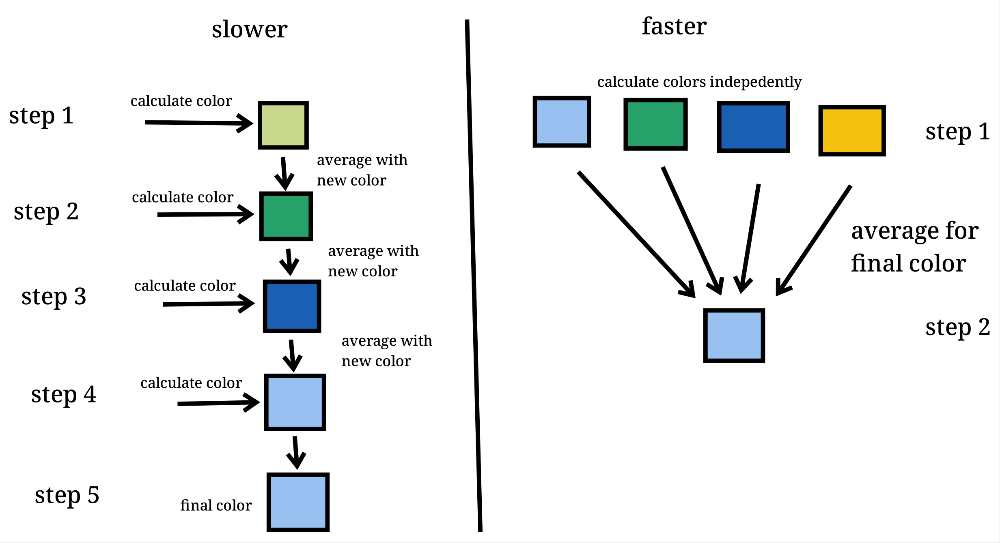
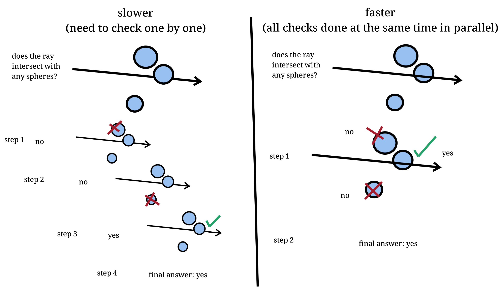
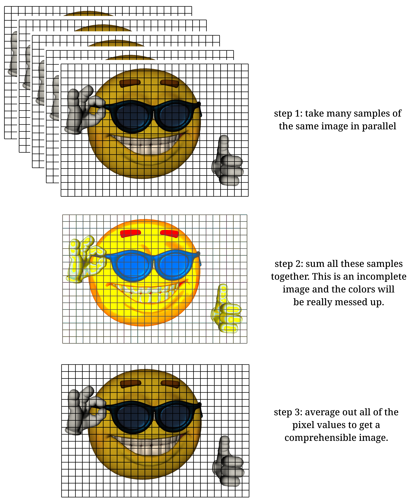
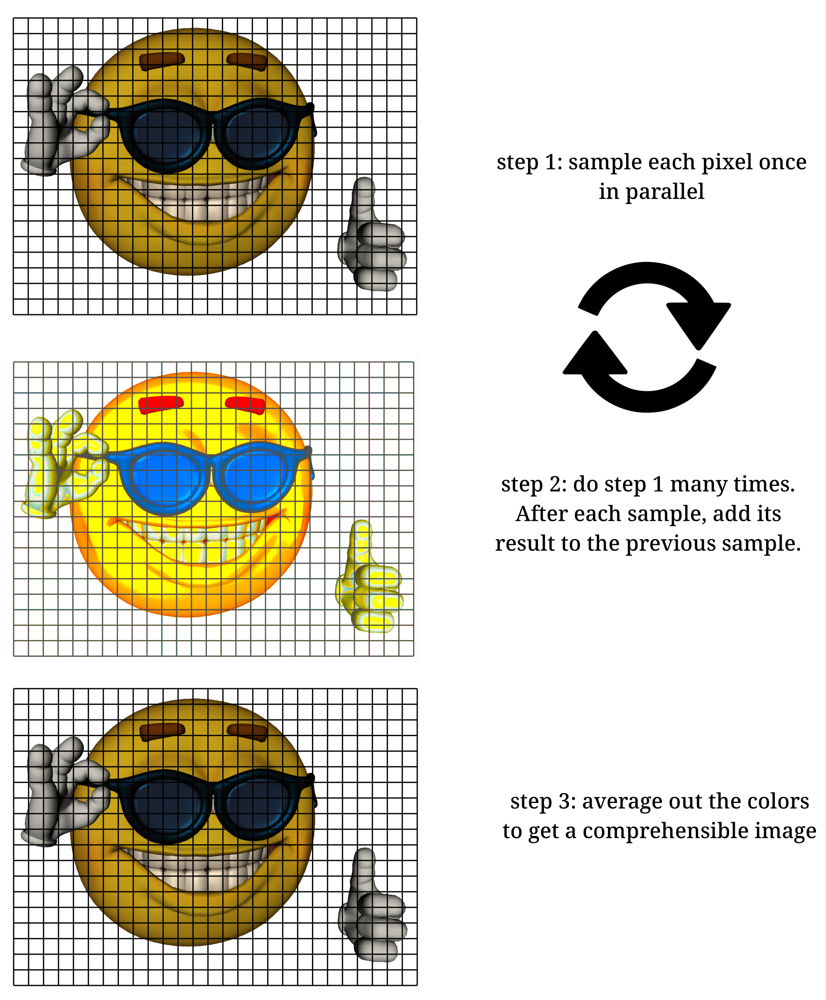

This past winter I completed the first book of the
[*Ray Tracing in One Weekend*](https://raytracing.github.io/)
book series by Peter Shirley, Trever D. Black, and Steve Hollasch. I wrote a
blog post about it that you can read
[here.](https://www.nsdigirolamo.com/posts/ray-tracing-in-one-weekend/) My ray
tracer ran, but it did not run particularly well. So after getting to a pretty
good stopping point I decided it would be a good exercise to try to accelerate
my code with parallelization. I learned how to do a bit of CUDA programming
during one of my university courses, so I decided to take that route to improve
my ray tracer.

## Reformatting and Restructuring

Getting started, the first thing I decided to do was cut out the features that
weren't really contributing anything to the project, or that would be an active
obstacle when using CUDA.

A lot of my ray tracing code used a vector class template for things like
recording the directions of rays. This vector class template inherited a lot of
its functionality from a matrix class template. I originally created the matrix
class template because I thought I was going to need it for matrix
transformations, but I was wrong. I have never actually used the matrices for
anything and they've only really added unnecessary complexity to my codebase.
So I removed the matrices and had the vectors just store all of their own
functionality.

Next, I took a look at all of my remaining classes and made sure they didn't
make any use of the standard library. Unfortunately, the C++ standard library
is only [supported in CUDA host code.](https://docs.nvidia.com/cuda/cuda-c-programming-guide/index.html?highlight=standard%20library#standard-library)
All of my classes will be used in a CUDA device kernel, so they all needed to
be clean of the standard library. The most difficult part of this process was
getting rid of all of my nice smart pointers and replacing them with raw
pointers. This was a pretty involved process because I was using smart pointers
to keep track of my abstract classes and all of that functionality needed to be
replaced with raw pointers instead.

## Kernel Design

Eventually, I reached the point where I could start working on new stuff! CUDA
speeds things up by executing CUDA *kernels* in parallel on many different CUDA
threads at once. I identified two key areas that could be parallelized.

### Pixel Sampling

Each pixel in the image gets a certain number of samples. These samples are
then averaged together to produce a final pixel color. These samples are not
dependent on each other, so I can assign each sample its own thread and then
calculate them all in parallel.

### Intersection Detection

Every time I sample the color of a pixel, I need to generate a ray and then
check that ray against all of the objects in a scene to see if it intersects.
These intersection checks can also be calculated independently. I can assign
a thread to each object in the scene and check for intersections against all
objects all at once.

### The Plan

As a first step, I decided to focus on only the pixel sampling process. I would
do this with three main kernels:

1. The first kernel would calculate color values for every sample of every
pixel in parallel. This should result in a 3D array of sampled color values.

2. The second kernel would reduce the 3D array of sampled color values down to
a 2D array of pixel color values. These pixel color values would just be sums
of the sampled color values.

3. The third kernel would divide each color in the second kernel by the number
of samples so the colors are averaged out.

I got to work implementing my kernels, and eventually created a compilable
program! Here is the first image I managed to output with my parallelized code:

You can see it didn't look great, but I was very excited to finally get an
output from something running on my GPU. The weirdness of the image is due to
the fact that I didn't have randomly scattered rays. CUDA device code has its
own random number generators available via
[cuRAND](https://docs.nvidia.com/cuda/curand/index.html), and I had not yet
integrated them into my codebase.

The above image was rendered at 1080 by 1920 resolution with 50 samples per
pixel and a maximum bounce depth of 50 bounces. It was rendered in parallel in
only 5.25 seconds on my GeForce GTX 1060. For context, the below image is
roughly equivalent and was rendered in serial with the same parameters and
took 1482.83 seconds (almost 25 minutes)!

Clearly, the serial version looks much better but I was confident they would
look exactly the same once I got the cuRAND library involved.

## A Random Roadblock

Randomization was a challenge. The cuRAND library's preferred way of generating
random numbers is to give each thread its own state, called a curandState, to
generate random numbers. The issue is that my GPU simply did not have enough
video memory to accomplish giving each thread its own state. For context, here
is the memory information for a 1080 * 1920 image rendered with 50 samples per
pixel (103,680,000 total threads):

- My GPU had 5.3 GB of free memory at its disposal.
- I used 25.2 MB to initialize the two objects in my scene (a sphere and a plane).
- I used 2.49 GB to store the 3D array of sample color data. Each color object is 24 bytes.
- I used 4.97 GB to store the 3D array of curandStates. Each curandState is 48 bytes.

The curandStates alone took up nearly all of the available memory on my GPU.
This was a big issue for me. I couldn't have threads share states, so I needed
to reshape my parallel algorithm to fit within my memory budget.

## Another Kernel Design

My existing plan was to process all samples at once in parallel. This takes
too much memory, so here's the new plan:

1. The first kernel calculates one sample per pixel in parallel instead of all
samples at once. After all pixels have been sampled, I'll store the sampled
colors in a 2D array.

2. I will run multiple iterations of the first kernel in a sequential loop.
This way, I can still do many samples of a pixel. After each loop I will add
the sampled colors together. This will produce the same result as kernel 2 in
my previous design.

2. The new second kernel is the same as the third above. We still will need to
divide the 2D array to get the averaged colors.

Now, I only need about 50 MB to store the color data, and 100 MB to store the
random state data! That gives me a lot of room in my memory budget to do other
things later if I choose.

## Results

And here is the output image! This was done using my new strategy, and it only
took me 5.71 seconds! I was concerned it would take longer because I'm
launching and relaunching kernels multiple times, but it seems like that
doesn't really effect its performance.

And here's a final render that I did for the end of the first *Ray Tracing in
One Weekend* book. This took 1755.42 seconds to render (around 30 minutes).
It's a 1920 by 1080 image but I rendered it with 100 samples per pixel and with
a maximum bounce depth of 100.

This new parallelized ray tracer has complete parity with my serial version, and
it's a lot more performant than the serial version. I'm really happy with the
results.
