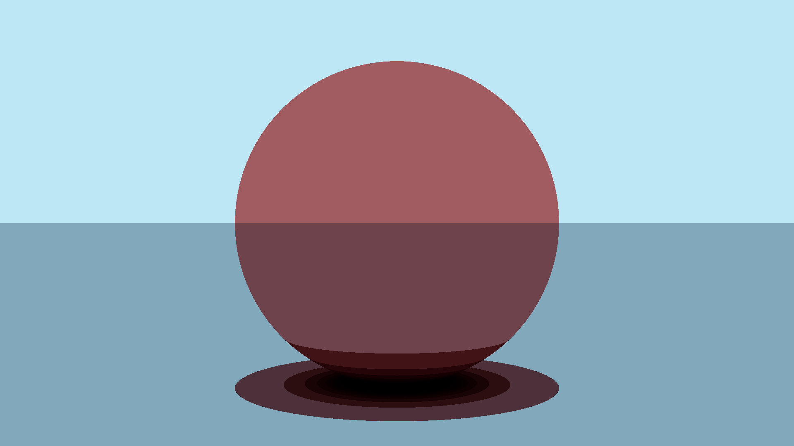
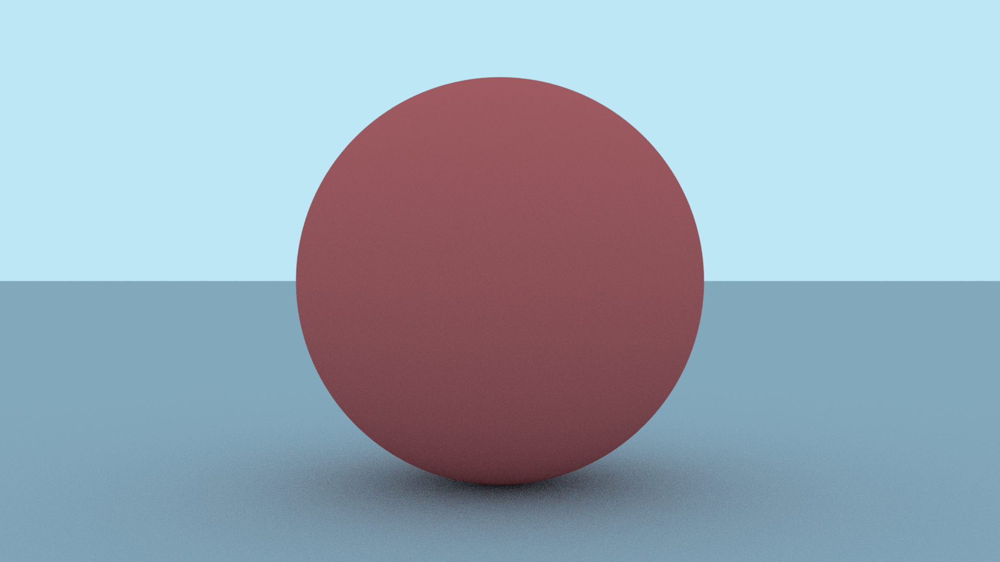

So after getting to a pretty good stopping point with my
[ray tracer]( ) I decided I wanted to try
to parallelize it on my GPU. I learned how to do a bit of CUDA programming during
one of my university courses, so I decided to take that route since I already
had a bit of experience. I took a look at my existing code and decided I needed
to make some major changes in order to get it to work nicely with CUDA.

## Reformatting and Restructuring

The first thing I did was completely remove my Matrix class template. This was
the base for my Vector class template, and I originally created it because I
thought I was going to need it for matrix transformations. I was wrong - I have
never actually used it for anything, and it's really only added unnecessary
complexity to my project.

Next, I took a look at all of my remaining classes and made sure they were no
longer using the C++ standard library. Unfortunately, the standard library is
only [supported in CUDA host code](https://docs.nvidia.com/cuda/cuda-c-programming-guide/index.html?highlight=standard%20library#standard-library)
and all of my class objects were going to be used in a CUDA device kernel in one
way or another, so they had to be clean of the standard library. The hardest
task during this was replacing all of my nice smart pointers with raw pointers.
I am no stranger to manual memory management so it wasn't too hard of a transition,
but it took a lot of time to make sure I was doing everything correctly.

## Kernel Design

Eventually, I reached the point where I could start doing new stuff! To parallelize
my code, there were a few paths I considered, but I settled on the following
because I considered it to be the simplest:

- In the first kernel, each thread would calculate a single sample of a single
pixel. If I had a 100 by 100 pixel image with 10 samples per pixel, I would have
100 * 100 * 10 = 100,000 threads.
- In the same kernel, each thread would store its sample's color information in
a single large 3D color array.
- After all threads are done calculating the samples, I would reduce the 3D sample
array down to a 2D pixel array with a new kernel.
- The 2D pixel array could then be copied to host code and written to a file.

I got to work implementing my kernels, and eventually created a compilable program!
Here is the first image I managed to output with my parallelized code:

You can see it doesn't look great, but I was very excited at finally getting
an output from my GPU. Right now, I think the weirdness partially comes from the
fact that there's no randomization yet. CUDA device code has its own pseudo-random
number generators available via [cuRAND](https://docs.nvidia.com/cuda/curand/index.html)
and at this point I hadn't gotten around to implementing any of it yet.

The above image was rendered at 1080 x 1920 resolution with 50 samples per pixel
and a maximum bounce depth of 50 bounces. It rendered in parallel in only 5.25
seconds! For context, the below image was rendered in serial with the same parameters
and took 1482.83 seconds (almost 25 minutes)!

Clearly, the serial version looks much better but I'm confident once I have
randomization working in the parallel version, they'll look exactly the same.
