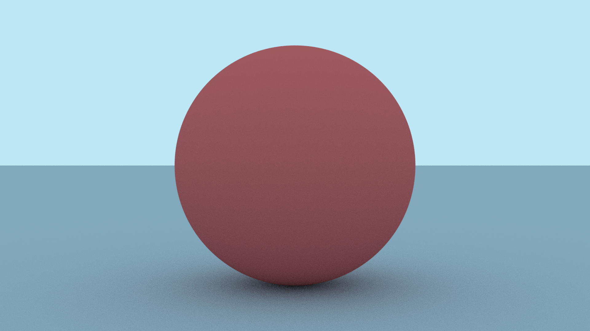
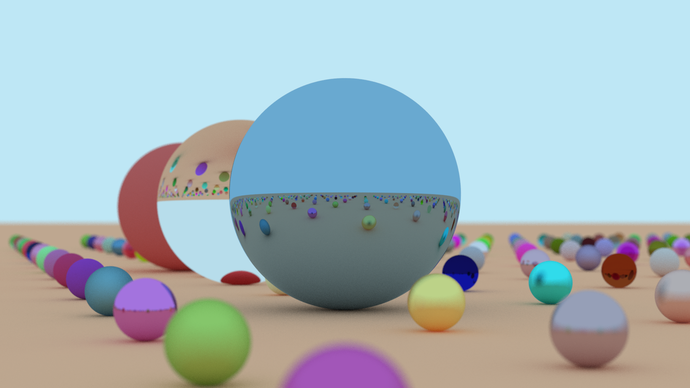

This past winter I completed the first book of the [Ray Tracing in One Weekend](https://raytracing.github.io/)
book series by Peter Shirley, Trever D. Black, and Steve Hollasch. My ray tracer
ran, but it did not run particularly well. So after getting to a pretty good
stopping point, I decided it would be a good exercise to try to accelerate
my code with parallelization. I learned how to do a bit of CUDA programming
during one of my university courses, so I decided to take that route to improve
my ray tracer.

## Reformatting and Restructuring

Getting started, the first thing I decided to do was cut out the features that
weren't really contributing anything to the project, or that would be an active
obstacle when using CUDA.

For example, my vector class template actually inherited a lot of its functionality
from a matrix class template. I originally had the matrix class template because
I thought I was going to need it for matrix transformations. I was wrong - I have
never actually used the matrices for anything, and they've only really added
unnecessary complexity to my codebase. So I removed the matrices, and had the
vectors just store all of their own functionality.

Next, I took a look at all of my remaining classes and made sure they didn't
make any use of the C++ standard library. Unfortunately, the standard library
is only [supported in CUDA host code.](https://docs.nvidia.com/cuda/cuda-c-programming-guide/index.html?highlight=standard%20library#standard-library) All of my classes will be used in
a CUDA device kernel, so they all needed to be clean of the standard library.
The most difficult part of this process was getting rid of all of my nice smart
pointers and replacing them with raw pointers. I don't find manual memory management
to be too hard, but it was still a pretty involved process because I used unique
and shared pointers to keep track of my abstract classes, and all of that functionality
needed to be replaced with raw pointers instead.

## Kernel Design

Eventually, I reached the point where I could start working on new stuff! I
identified two key areas that could be parallelized:

- **Pixel Sampling:** Each pixel in the image gets a certain number of samples,
which are averaged together to produce a final color. These samples can be
calculated independently, so I can assign each sample its own thread and calculate
them all in parallel.
- **Intersection Detection:** Each sample has its own ray that needs to be checked
for intersections between all the objects in a scene. These intersections can
also be calculated independently, so I could also assign each thread an object
in the scene, and just get the thread to check if the ray intersects its
assigned object.

And one area that I didn't think could be ran in parallel:

- **Sample Tracing:** The actual ray tracing process for each ray is dependent
on the results of the previous ray, so I did not really see a way of parallelizing
it. If I cast a ray from the camera, I won't be able to know what it has hit
until I've actually done the intersection detection. I can't calculate future
rays until I know the results of the current ray.

As a first step, I decided to focus on only the pixel sampling process. I would
do this with three main kernels:

1. The first kernel would calculate all samples for all pixels in parallel. This
would mean launching a number of threads equal to the display resolution multiplied
by the number of samples per pixel. For example, if I was trying to render a
1920 x 1080 resolution image with 50 samples per pixel, I would be launching 1920 *
1080 * 50 = 103,680,000 threads, and each thread would be assigned a sample.

2. The second kernel would reduce the results of the first kernel down to a two-dimensional
array pixel values. The first kernel would generate a 1080 * 1920 * 50 three-dimensional
array of sampled color values, and the second kernel would add all of those values to
create just a 1080 * 1920 array of pixel color values.

3. The third kernel would divide the results of the second kernel by the number
of samples per pixel. This is done to average the colors and ensure they're not
just huge sums of the sample values.

I got to work implementing my kernels, and eventually created a compilable program!
Here is the first image I managed to output with my parallelized code:

You can see it didn't look great, but I was very excited to finally get an output
from code ran on my GPU. The weirdness of the image is due to the fact that I
didn't have randomly scattered rays. CUDA device code has its own random number
generators available via [cuRAND](https://docs.nvidia.com/cuda/curand/index.html),
and I had not yet implemented it.

The above image was rendered at 1080 by 1920 resolution with 50 samples per pixel
and a maximum bounce depth of 50 bounces. It was rendered in parallel in only 5.25
seconds! For context, the below image is roughly equivalent and was rendered
in serial with the same parameters and took 1482.83 seconds (almost 25 minutes)!

Clearly, the serial version looks much better but I was confident they would
look exactly the same once I got the cuRAND library involved.

## A Random Roadblock

Randomization was a challenge. The cuRAND library's preferred way of generating
random numbers is to give each thread its own state, called a curandState, to
generate random numbers. The issue is that my GPU simply did not have enough
video memory to accomplish giving each thread its own state. For context, here
is the memory information for a 1080 * 1920 image rendered with 50 samples per
pixel (103,680,000 total threads):

- My GPU had 5.3 GB of free memory at its disposal.
- I used 25.2 MB to initialize the two objects in my scene (a sphere and a plane).
- I used 2.49 GB to store the 3D array of sample color data. Each color object is 24 bytes.
- I used 4.97 GB to store the 3D array of curandStates. Each curandState is 48 bytes.

The curandStates alone took up nearly all of the available memory on my GPU.
This was a big issue for me. I couldn't have threads share states, so I needed
to reshape my parallel algorithm to fit within my memory budget.

## Another Kernel Design

My existing plan was to process all samples at once in parallel. This takes
too much memory, so here's the new plan:

1. The first kernel calculates samples for each pixel in parallel, but instead
of calculating all samples for all pixels at once, we only calculate the results
for a single sample. We can store this sample in a 2D array, and then run the
kernel again in a loop, storing the sample data in the same array. We loop for
each sample, and by the end will have a result that would have been the same as
out first two previous kernels.

2. The second kernel is the same as the third above. We still will need to divide
the 2D array to get the averaged colors.

Now, I only need about 50 MB to store the color data, and 100 MB to store the
random state data! That gives me a lot of room in my memory budget to do other
things later if I choose.

And here is the output image! This was done using my new strategy, and it only
took me 5.71 seconds! I was concerned it would take longer because I'm launching
and relaunching kernels multipl times, but it seems like that doesn't really
effect its performance.

And here's a final render that I did for the end of the first *Ray Tracing in One
Weekend* book. This took 1755.42 seconds to render (around 30 minutes). It's
a 1920 * 1080 image but I rendered it with 100 samples per pixel with a maximum
bounce depth of 100.

This new parallelized ray tracer has complete parity with my serial version, and
it's a lot more performant than the serial version. I'm really happy with the
results.
