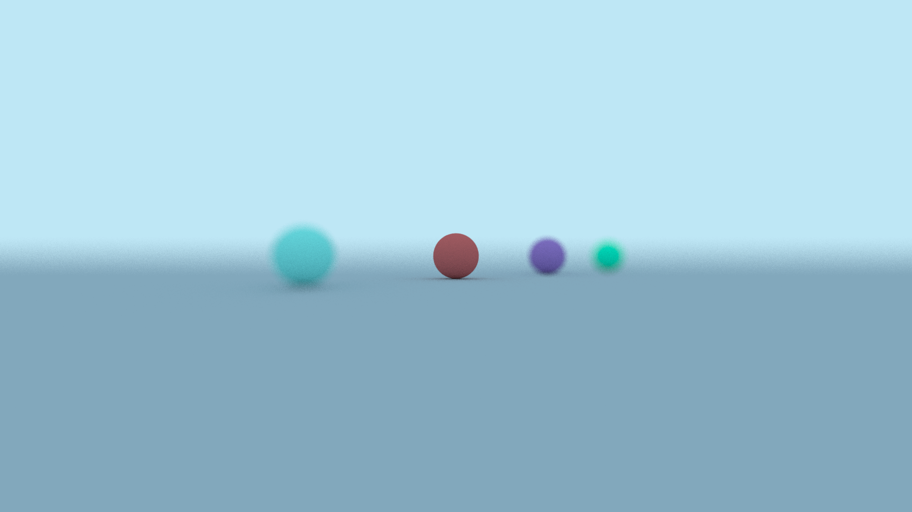

This past winter I completed the first book of the [Ray Tracing in One Weekend](https://raytracing.github.io/)
book series by Peter Shirley, Trever D. Black, and Steve Hollasch. My ray tracer
ran, but it did not run particularly well. So after getting to a pretty good
stopping point, I decided it would be a good exercise to try to accelerate
my code with parallelization. I learned how to do a bit of CUDA programming
during one of my university courses, so I decided to take that route to improve
my ray tracer.

## Reformatting and Restructuring

Getting started, the first thing I decided to do was cut out the features that
weren't really contributing anything to the project, or that would be an active
obstacle when using CUDA.

For example, my vector class template actually inherited a lot of its functionality
from a matrix class template. I originally had the matrix class template because
I thought I was going to need it for matrix transformations. I was wrong - I have
never actually used the matrices for anything, and they've only really added
unnecessary complexity to my codebase. So I removed the matrices, and had the 
vectors just store all of their own functionality.

Next, I took a look at all of my remaining classes and made sure they didn't
make any use of the C++ standard library. Unfortunately, the standard library
is only [supported in CUDA host code.](https://docs.nvidia.com/cuda/cuda-c-programming-guide/index.html?highlight=standard%20library#standard-library) All of my classes will be used in
a CUDA device kernel, so they all needed to be clean of the standard library.
The most difficult part of this process was getting rid of all of my nice smart
pointers and replacing them with raw pointers. I don't find manual memory management
to be too hard, but it was still a pretty involved process because I used unique
and shared pointers to keep track of my abstract classes, and all of that functionality
needed to be replaced with raw pointers instead.

## Kernel Design

Eventually, I reached the point where I could start working on new stuff! First,
I identified a few places in my program that could and could not be parallelized.

### What could be parallelized?

- **Pixel Sampling:** Each pixel in the image gets $x$ samples, which are averaged
together to produce a final color. These samples can be calculated independently,
so they were a perfect candidate for parallelization.
- Intersection detection. 

Eventually, I reached the point where I could start doing new stuff! To parallelize
my code, there were a few paths I considered, but I settled on the following
because I considered it to be the simplest:

- In the first kernel, each thread would calculate a single sample of a single
pixel. If I had a 100 by 100 pixel image with 10 samples per pixel, I would have
100 * 100 * 10 = 100,000 threads.
- In the same kernel, each thread would store its sample's color information in
a single large 3D color array.
- After all threads are done calculating the samples, I would reduce the 3D sample
array down to a 2D pixel array with a new kernel.
- The 2D pixel array could then be copied to host code and written to a file.

I got to work implementing my kernels, and eventually created a compilable program!
Here is the first image I managed to output with my parallelized code:

You can see it doesn't look great, but I was very excited at finally getting
an output from my GPU. Right now, I think the weirdness partially comes from the
fact that there's no randomization yet. CUDA device code has its own pseudo-random
number generators available via [cuRAND](https://docs.nvidia.com/cuda/curand/index.html)
and at this point I hadn't gotten around to implementing any of it yet.

The above image was rendered at 1080 x 1920 resolution with 50 samples per pixel
and a maximum bounce depth of 50 bounces. It rendered in parallel in only 5.25
seconds! For context, the below image was rendered in serial with the same parameters
and took 1482.83 seconds (almost 25 minutes)!

Clearly, the serial version looks much better but I'm confident once I have
randomization working in the parallel version, they'll look exactly the same.

## Randomization Roadblock

Randomization has been a challenge. The cuRAND library's preferred way of
generating random numbers is to give each thread its own curandState... and I
simply do not have enough memory on my GPU to accomplish that. To give you some
grasp of the numbers involved, here are the numbers for a 1080 x 1920 image with
50 samples per pixel. I will have 1080 x 1920 x 50 = 103,680,000 samples, and
one thread per sample.

- 5.3 GB free before doing any kernel setup.
- 25.2 MB for the objects in my scene.
- 2.49 GB for the array of samples. Each sample is 24 bytes.
- 4.97 GB for the array of curandStates. Each curandState is 48 bytes.

The curandStates alone take up nearly all of the available memory on my GPU. And
this is a pretty big problem. I can't have threads share curandStates (at least
I don't think I can) so I'm going to need to reshape my data so it all fits
within memory budget.

My current plan is to process all samples at once in parallel. These samples are
then reduced to a single image as a final step.

Instead, I could process a single sample for all pixels, average that color onto
the final image, and process a new set of samples. This will likely be slower than
my current plan because I'm going to be launching and relaunching kernels in a loop,
but at least I won't be maxing out my GPU memory.

And here is the output image! This was done using my new strategy, and it only
took me 5.71 seconds!

I guess running a kernel in a loop doesn't cost as much
overhead as I thought it would. This new parallelized ray tracer has complete
parity with my serial version... so now it's time to do some drag racing.

## Some Fun Comparisons

Below is another 1080 x 1920 image rendered in parallel. It took 4.35 seconds
to render with 50 samples per pixel and a maximum bounce depth of 50. I rendered
an equivalent image on the serial program, and it took 1186.39 seconds (almost 20
minutes)!

