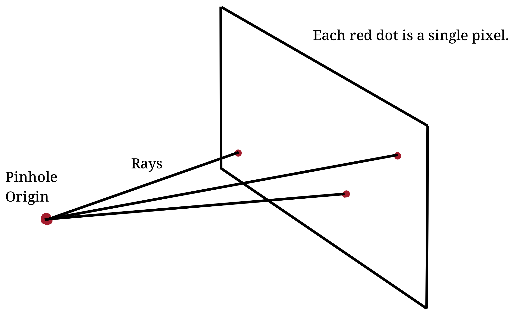

This post is going to be a kind of retrospective on the
[ray tracer](https://github.com/nsdigirolamo/ray-tracing-playground) I wrote in
C++ over my 2024 winter break. It was my third time making a ray tracer, and if
you're curious about my previous attempts you can find my other projects
[here](https://github.com/nsdigirolamo/ray-tracing-in-one-weekend)
and [here](https://github.com/nsdigirolamo/nicks-ray-tracer). All three projects
are based heavily around the free online textbook series
[*Ray Tracing in One Weekend*](https://raytracing.github.io/) by Peter Shirley,
Trevor Black, and Steve Hollasch.

You might question why I decided to start work on the same project after
completing it two previous times. The truth is, my two previous attempts felt
like I was just following instructions rather than actually learning anything.
This time around my intention was to gain a deeper understanding into how ray
tracers actually worked rather than just copy/pasting from the textbook. I
wanted to use the textbook for feature ideas, but I made a genuine effort to
avoid a one-to-one copy of the textbook's implementation. I think I succeeded
in my goals, and wanted to share my through process along the way.

## Getting Started

Below is one of the first images I created. I projected rays from the camera
and when those rays intersected with the sphere I would return their surface
normals. Then, I used the x, y, and z components of those normals to color the
sphere's surface. This was pretty basic but I was excited about my progress
regardless.


## Diffuse Materials

My next task was to add a diffuse material for the sphere so I could start
bouncing rays and tracing their paths. Objects with diffuse materials are great
for this, because they randomly scatter light that hits their surfaces. Below
is an image of my first attempt.


And here was my first obstacle. Clearly, something is wrong. What's going on
with all that weird banding? After some searching online, I learned that the
issue likely has to do with how I determine light-object intersections in my
code.

But what is a light-object intersection? As the name implies, it's where a light
ray intersects with an object. After I calculate the intersection, I can create
a new ray that originates from it and scatter that ray in some random direction.

Here is roughly what my code looks like:

```C++
if ( /** does the ray intersect the object? */ ) {

	double distance = /** distance along the ray where the intersection occurs */

	Point intersection = ray.origin + ray.direction * distance;

	return intersection;
}
```

Hopefully the above pseudocode isn't too difficult to read. I check to make sure
an intersection exists, and if it does I get the distance along my ray where the
intersection occurs. Then I just return the intersection.

So where's the issue? Well, once an intersection occurs, I spawn a new ray with
its origin at the intersection point. This new ray runs the same code, looking
for intersections with objects. It *should* look something like below.


The origin of the newly scattered ray should be right where the intersection
occurs - that is, on the surface of the object. But due to floating point errors
this intersection point is not exactly where it should be, and sometimes is
calculated to be *below* the object's surface.

When this happens, the newly generated ray can't escape the object, and it fails
to scatter. The ray just intersects the same surface it originally hit. A
diagram of the behavior is shown below.


Below solves the issue. Floating point errors are typically very small, so all I
need to do is throw out any intersections that don't meet some some minimum
distance along the ray.

```C++
double minimum_distance = 0.0001

if ( /** check for ray intersection */ ) {

	double distance = /** distance along the ray where the intersection occurs */

	if (distance < minimum_distance) { return; }

	Point intersection = ray.origin + ray.direction * distance;

	return intersection;
}
```

Below is the same image with the issue solved. Much nicer looking. If you're
curious, I solved this issue after discovering
[this reddit post](https://www.reddit.com/r/rust/comments/nacl51/weird_banding_on_custom_ray_tracer/)
with basically the same issue I was having. The
[top comment](https://www.reddit.com/r/rust/comments/nacl51/weird_banding_on_custom_ray_tracer/gxted9h/)
explained what they thought was the issue, and that's what led me to the
solution. Ironically, if I had been reading the *Ray Tracing in One Weekend*
textbook as obsessively as I was in my last two ray tracing projects, I would
have quickly found their
[solution](https://raytracing.github.io/books/RayTracingInOneWeekend.html#diffusematerials/fixingshadowacne)
to this problem. They seemed to agree with me that the issue came down to some
floating point issues. Regardless, I'm happy I was able to find the
fix on my own without simply being given the solution by the textbook.


## Metallic Materials

The next step for me was the implement the other materials from the textbook.
I knew I needed metals and refractive materials. Metals were pretty easy - their
implementation was pretty close to diffuse materials, and I just needed to
reflect the rays instead of randomly scattering them.


## Refractive Materials

Refractive materials were much harder than the other two materials. I spent a
long time studying a few different resources to try to implement refraction in
my code. The [wikipedia page](https://en.wikipedia.org/wiki/Snell's_law) for
Snell's Law and
[a physics stack exchange post](https://physics.stackexchange.com/a/436252)
about Snell's Law in vector form were both really helpful in developing my
understanding. I felt like I had an OK grasp on the theory behind refraction,
but I just couldn't translate that into the code. I tried and tried, but it was
just not working for me.

So I just ended up copying the code from textbook. Not ideal, but I tried my
best. Eventually I want to return to refractive materials, but after banging my
head against the wall for so long I really just wanted to work on the rest of
the ray tracer. And below is an image of the refractive materials.


## Depth of Field

Next was depth of field. And another obstacle.

Before my depth of field implementation, my camera was simulated as a pinhole
lens with a viewport in front of it. For each pixel, I would originate some
number of rays at the pinhole and direct them to the pixel's position on the
viewport. All of the rays had basically the same initial direction, so
everything would always be in perfect focus.



After the depth of field implementation, my camera's lens was simulated as an
infinitely thin disk with a viewport in front of it. For each pixel, I would
originate the rays at random locations on the disk and direct them to the
pixel's position on the view port.

These random origins would mean that all rays would still be focused on the same
position on the viewport, but they would be approaching it from different
directions. An object that intersected the viewport would be in perfect focus,
but objects in front of or behind the viewport would be out of focus.

A great idea, but it wasn't working. The entire scene was always out of focus.


Eventually, I discovered the reason for this.

Up to this point, my ray tracer has been simulating a camera with a pinhole lens
with perfect focus. To get the color for a pixel, I would project a ray from
the *camera's origin* to the pixel's location in space. Since every ray would
have the same origin and same direction, everything would be in focus.

But when I wanted to add a defocus, the *ray origin* was now no longer the same
as the *camera origin*. Ray directions were the same, but their origins were
offset by some small random amount. I was not compensating for this offset,
so rays would not be focused on the pixel they were supposed to be pointed at.

My camera's lens was suddenly no longer a pinhole, but instead just a very wide
and not very special hole that light was passing through. Big holes do not make
good lenses, hence the complete lack of focus. To fix this, all I had to do was
slightly adjust the ray directions by the random disk offset. Now my disk would
act like a proper lens!

Below you can see what I mean. The left diagram is depth of field working
properly. The right is the unadjusted rays.


And below is depth of field working properly!


## Next Steps

After depth of field, the textbook suggests a final render to show off the ray
tracer. I decided to go in a different direction instead - I wanted to
accelerate the ray tracer using CUDA. The renderer was running pretty slowly,
so I figured this would be a great opportunity to improve my parallelism skills
and speed up the program.

For those curious, I made a
[follow-up post](https://www.nsdigirolamo.com/posts/cuda-ray-tracing/) where I
describe how I converted this serial program into something that could be ran
on my GPU.
