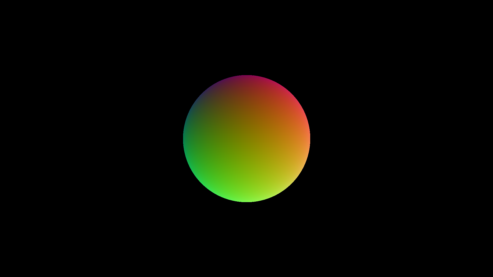
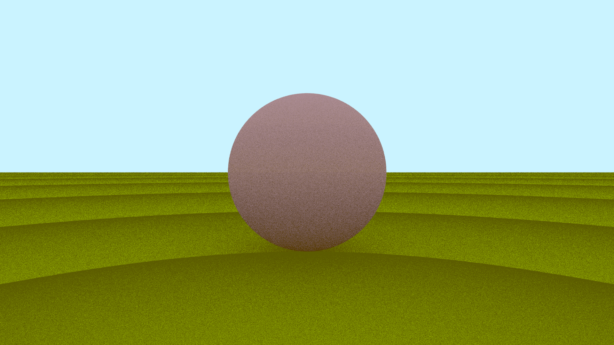
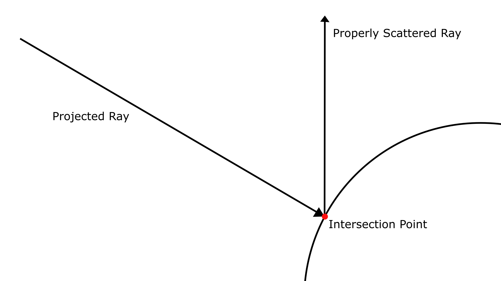
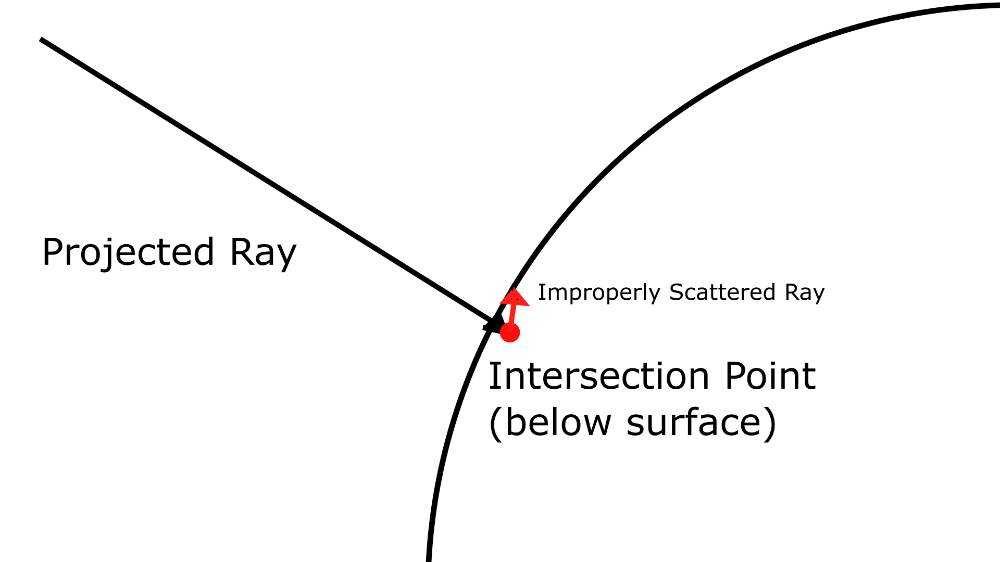
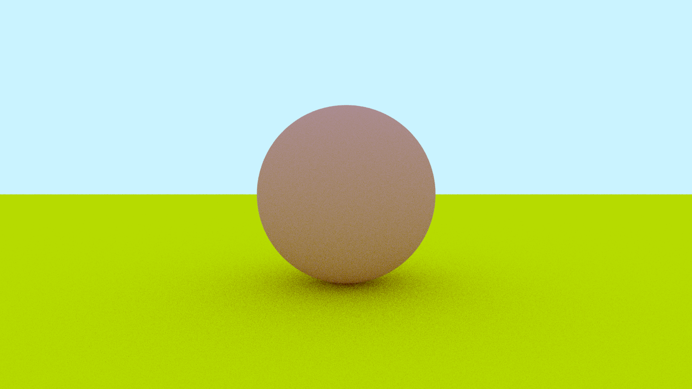
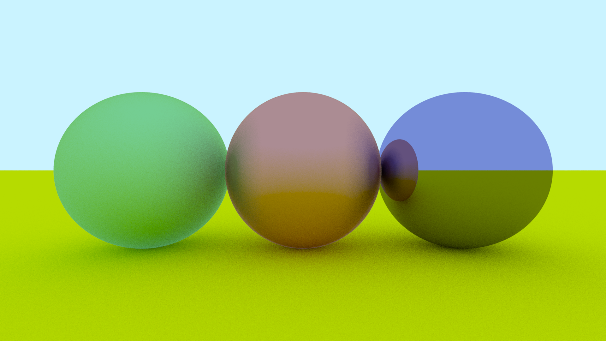
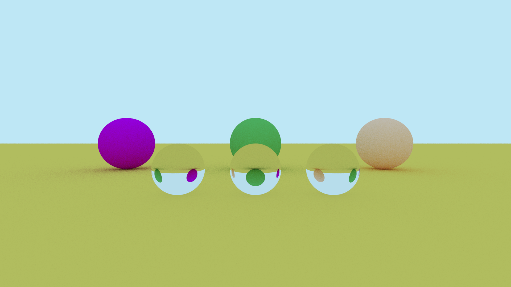
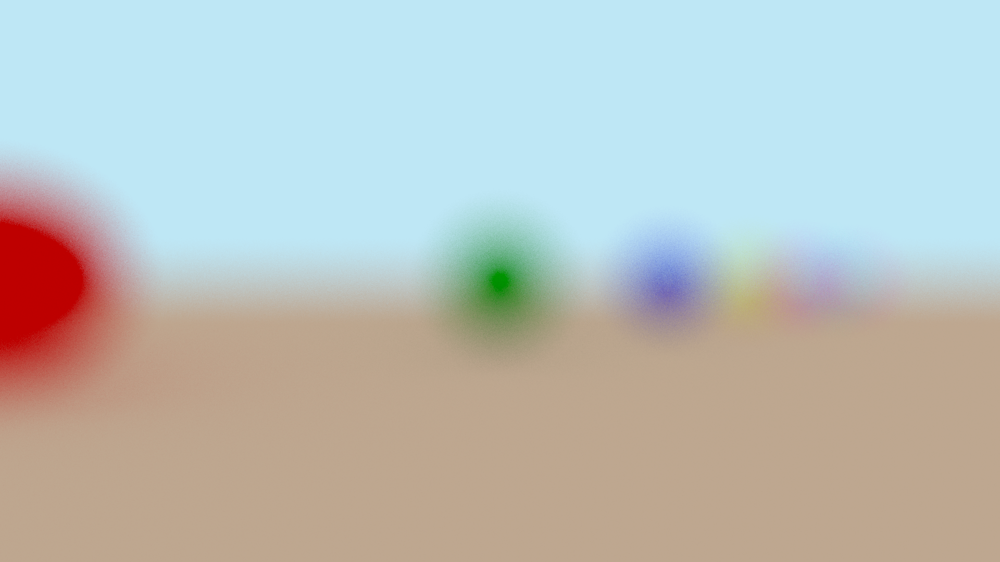
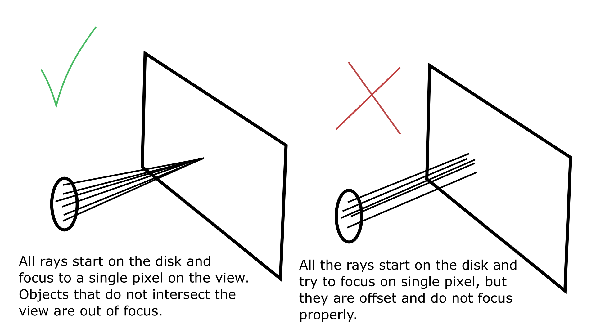
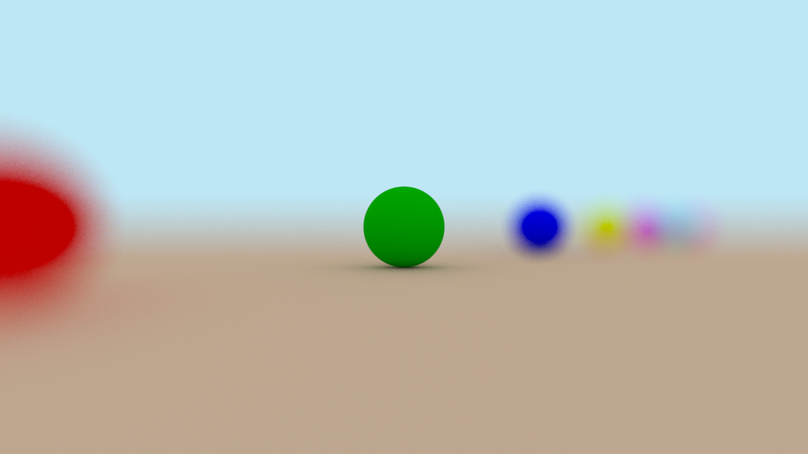

This post is going to be about the
[ray tracer](https://github.com/nsdigirolamo/ray-tracing-playground) I'm writing
in C++. This is my third attempt now at making a ray tracer. My previous
projects on this topic can be found
[here](https://github.com/nsdigirolamo/ray-tracing-in-one-weekend) and
[here](https://github.com/nsdigirolamo/nicks-ray-tracer). All three projects are
based heavily around the free online textbook series
[*Ray Tracing in One Weekend*](https://raytracing.github.io/) by Peter Shirley,
Trevor Black, and Steve Hollasch.

I want to gain a deeper understanding into how ray tracers are created. My
previous two attempts felt like I was just following instructions rather than
actually learning anything. This time around I intend on spending more time
gaining a proper understanding of the things I'm creating, rather than just
copy/pasting from the textbook. I'm still going to be using the textbook for
feature ideas, but I am going to try to avoid just reading the code explanations
and just making a one-to-one copy of their implementation.

Most importantly, I'm going to try my best to solve problems with my own
research and only resort to the textbook if I get really stuck.

Below is one of the first images I created. I projected rays from the camera
and when those rays intersected with the sphere I would return their surface
normals. Then, I used the x, y, and z components of those normals to color the
sphere's surface.



## Diffuse Materials

My next task was to add a diffuse material for the sphere, so it could start
bouncing light. You can see my first attempt below.



Clearly, something is wrong. What's going on with all that weird banding? The
issue has to do with my intersection code. Below is an approximation of what's
going on:

```
if ( /** check for ray intersection */ ) {

	double distance = /** distance along the ray where the intersection occurs */

	Point intersection = ray.origin + ray.direction * distance;

	Hit hit { intersection };

	return hit;
}
```

Hopefully the above pseudocode isn't too difficult to read. I check to make sure
an intersection exists, and if it does I get the distance along my ray where the
intersection occurs. The issue comes along when I start recursively scattering
rays.

Once an intersection occurs, I spawn a new ray with its origin at the
intersection point. The ray will start at this origin, and then look along
whatever direction its pointing for an intersection with an object.



But the origin of my scattered ray is going to be on the very surface of an
object, so the ray *might* detect an intersection at its own origin! I suspect
the banding comes from some weird floating point issues, where sometimes the
origin isn't *exactly* on the surface of the plane, so the rays sometimes manage
to not intersect with the surfaces they're originating from.



Below solves the issue. I just need to throw out any intersections that don't
meet some some minimum distance along the ray.

```
double minimum_distance = 0.0001

if ( /** check for ray intersection */ ) {

	double distance = /** distance along the ray where the intersection occurs */

	if (distance < minimum_distance) { return {}; }

	Point intersection = ray.origin + ray.direction * distance;

	Hit hit {intersection};

	return hit;
}
```

Below is the same image with the issue solved. Much nicer looking. I found the
solution to this problem after a quick google search. I found
[this reddit post](https://www.reddit.com/r/rust/comments/nacl51/weird_banding_on_custom_ray_tracer/)
with basically the same issue I was having, and the
[top comment](https://www.reddit.com/r/rust/comments/nacl51/weird_banding_on_custom_ray_tracer/gxted9h/)
explained what they thought was the issue, and that's what led me to the
solution. Ironically, if I had been reading the *Ray Tracing in One Weekend*
textbook as religiously as I was in my last two ray tracing projects, I would
have quickly found their
[solution](https://raytracing.github.io/books/RayTracingInOneWeekend.html#diffusematerials/fixingshadowacne)
to this problem. They seemed to agree with me that the issue came down to some
floating point issues. Regardless, I'm happy I was able to find the
fix on my own without simply being given the solution.



## Metallic Materials

The next step for me was the implement the other materials from the textbook.
I knew I needed metals and refractive materials. Below are my metals.



## Refractive Materials

The refractive materials and their related concepts were something I just could 
not get into code. I spent a really long time studying a lot of different 
resources to try to do it on my own. The wikipedia page for 
[Snell's Law](https://en.wikipedia.org/wiki/Snell's_law) and 
[this](https://physics.stackexchange.com/a/436252) physics stack exchange post 
about Snell's Law in vector form were helpful, and from those resources I feel
like I have an OK grasp on the theory behind refraction. I just don't
understand it well enough to translate it into the ray tracer.

So I just ended up copying the code from textbook. Not ideal, but I tried my
best. Eventually I want to return to refractive materials, but for now I need 
to move on or else I'll be stuck here for much longer than I want.



## Depth of Field

Next was depth of field.

Internally, the code creates this depth of field effect with an infinitely thin
disk behind the view port. Ray origins are randomly sampled from the thin disk,
and are projected into the view port. The view port itself exists as a plane in 
the 3D scene, and objects in the scene are most in focus where the view plane 
intersects with them. For the longest time, my depth of field effect was just 
not working. The entire scene was out of focus instead of just the objects that 
I wanted. 



Eventually, I discovered the reason for this. 

Up to this point, my ray tracer has been simulating a camera with a pinhole lens
with perfect focus. To get the color for a pixel, I would project a ray from
the **camera's origin** to the pixel's location in space. Since every ray would
have the same origin and same direction, everything would be in focus.

But when I wanted to add a defocus, the **ray origin** was now no longer the same
as the **camera origin**. Ray directions were the same, but their origins were
offset my some amount. I was not compensating for this offset, so rays would
not be focused on the pixel they were supposed to be pointed at. My camera's
lens was suddenly no longer a pinhole, but instead was much wider. This was the
cause of my camera's complete lack of focus. To fix this, all I had to do was
adjust for the offset.

Below you can see what I mean. The left diagram is depth of field working
properly. The right is the unadjusted rays.



And below is depth of field working properly!

